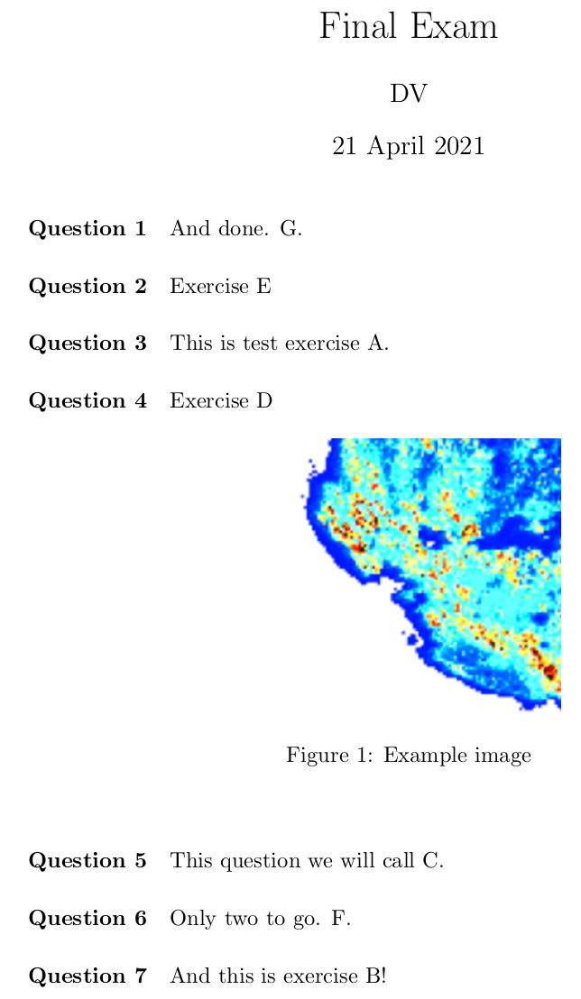

# shuffled_exam
Creates shuffled versions of exam from given exam questions from tex files and generates individual pdf file for each exam taker.

### Structure
- `/exercises/`: Individual exercises in folder
- `/images/`: Example images
- `/info/`: Set exam information, participant names etc.
- `local.definitions`: Contains all necessary information
- `master_exam`: Master file for generated .tex files for each exam. Change details and add packages if necessary
- `shuffled_exam.sh`: Script to compile exams.

### How-to
- generate individual tests for participants with
`bash shuffled_exam.sh`
- Final pdf files for each participant will be generated in `/exams/`

### Images

Example exam with shuffled questions
